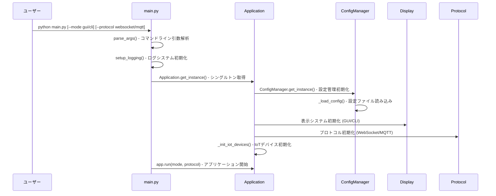
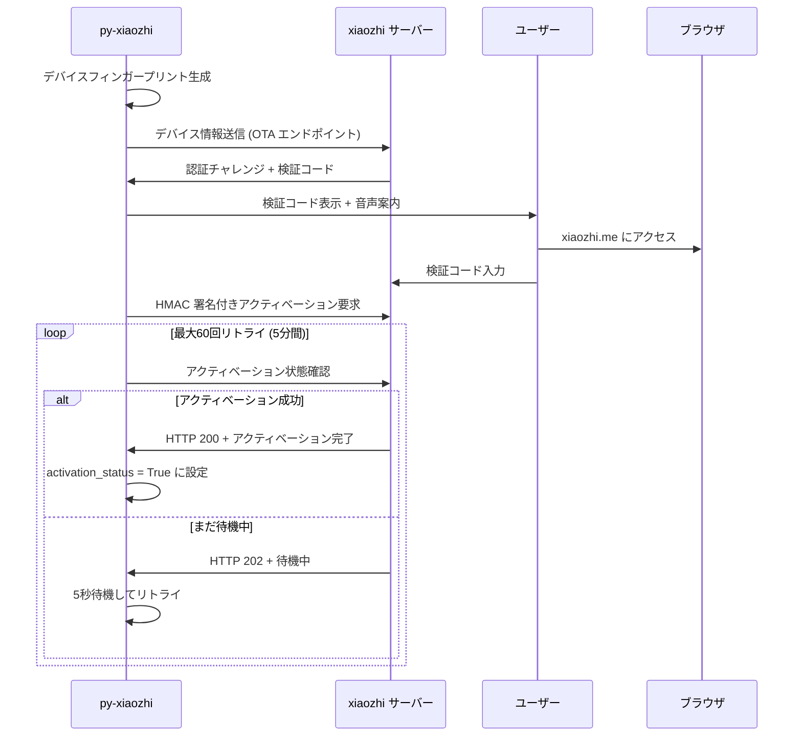
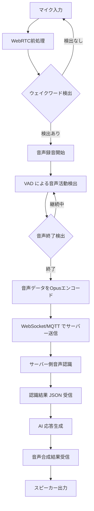
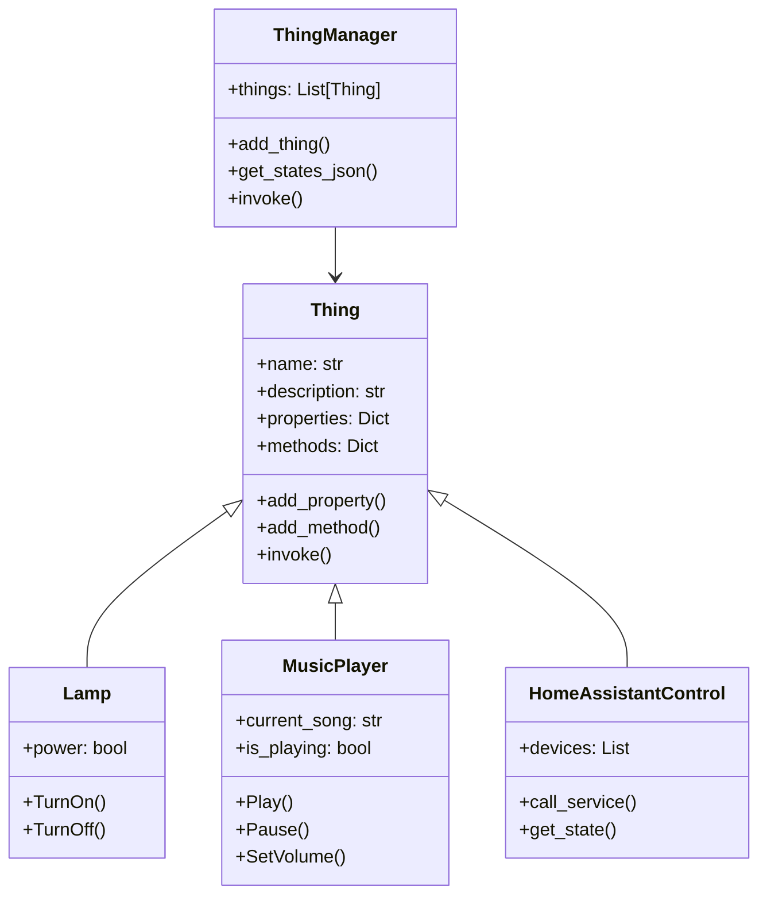
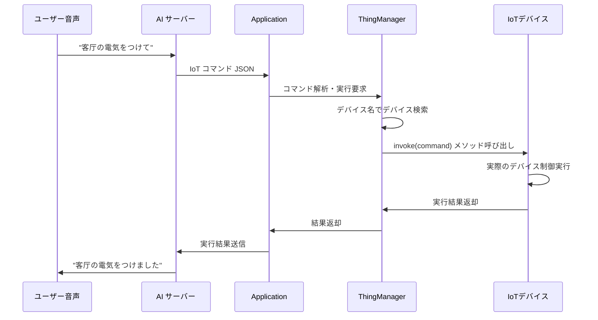
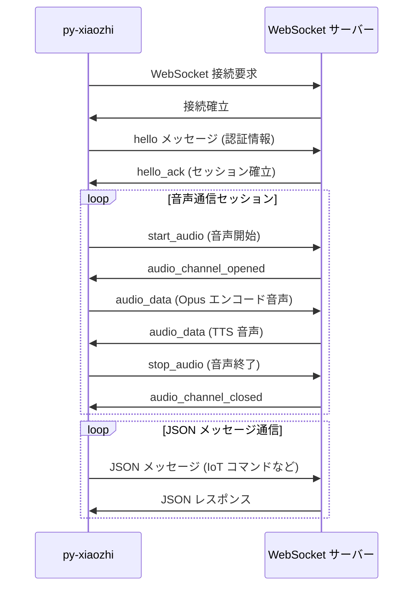
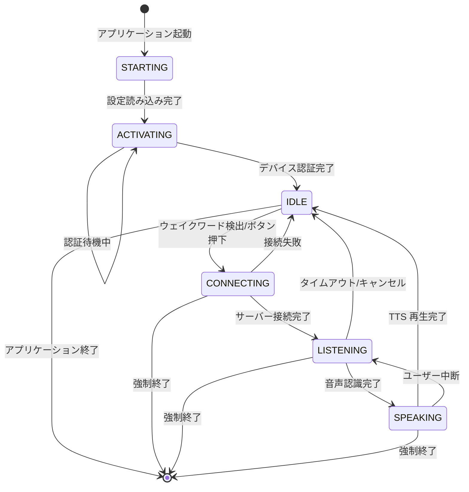

# py-xiaozhi 処理フロー説明

## 概要

py-xiaozhi は AI 音声アシスタントの Python クライアント実装です。このドキュメントでは、アプリケーションの起動から音声認識、AI 応答、IoT 制御までの全体的な処理フローを詳しく説明します。

## システム構成図

```
┌─────────────────┐    ┌─────────────────┐    ┌─────────────────┐
│     ユーザー     │    │   py-xiaozhi    │    │   サーバー側     │
│                 │    │    クライアント    │    │                 │
├─────────────────┤    ├─────────────────┤    ├─────────────────┤
│ • 音声入力       │    │ • 音声処理       │    │ • AI モデル      │
│ • GUI/CLI操作   │◄──►│ • プロトコル通信  │◄──►│ • 音声認識       │
│ • IoTデバイス    │    │ • IoT制御       │    │ • 音声合成       │
└─────────────────┘    └─────────────────┘    └─────────────────┘
```

## 1. アプリケーション起動フロー

### 1.1 初期化シーケンス



### 1.2 設定管理フロー

```python
# ConfigManager の処理フロー
1. config/config.json の存在確認
2. ファイルが存在しない場合 → DEFAULT_CONFIG から生成
3. 設定ファイル読み込み
4. デフォルト設定とマージ
5. デバイス固有情報の生成 (CLIENT_ID, DEVICE_ID)
6. 設定値のメモリキャッシュ
```

## 2. デバイスアクティベーションフロー

### 2.1 初回起動時の認証プロセス



### 2.2 認証後の接続フロー

```python
# 認証済みデバイスの接続プロセス
1. efuse.json からデバイス情報読み込み
2. アクティベーション状態確認
3. WebSocket/MQTT 接続確立
4. サーバーとのハンドシェイク
5. 音声チャネル開通
6. IoT デバイス状態同期
```

## 3. 音声処理フロー

### 3.1 音声入力から認識までの流れ



### 3.2 音声処理コンポーネント詳細

#### WebRTC 音声前処理 (webrtc_processing.py)
```python
1. エコーキャンセレーション (AEC)
   - スピーカー出力がマイクに混入するエコーを除去
   
2. ノイズ抑制 (NS)
   - 環境ノイズを自動的に軽減
   
3. 自動ゲイン制御 (AGC)
   - 音量レベルを自動調整
   
4. ハイパスフィルタ
   - 低周波ノイズを除去
```

#### ウェイクワード検出 (wake_word_detect.py)
```python
1. Vosk 音声認識モデルによるリアルタイム認識
2. ピンイン（拼音）ベースのファジーマッチング
   - 標準ピンイン: xiǎo zhì
   - 音調なし: xiao zhi
   - 頭文字: x z
   - 韻母: iao i
3. 編集距離による類似度計算
4. LRU キャッシュによる高速化
```

#### VAD 検出 (vad_detector.py)
```python
1. WebRTC VAD エンジンによる音声活動検出
2. エネルギー閾値による二重チェック
3. 連続フレーム解析による信頼性向上
4. ユーザー発話による AI 応答中断検出
```

## 4. IoT デバイス制御フロー

### 4.1 IoT アーキテクチャ



### 4.2 IoT コマンド実行フロー



### 4.3 対応 IoT デバイス

#### 仮想デバイス
- **Lamp**: 照明のオン/オフ制御
- **MusicPlayer**: オンライン音楽の再生制御
- **Speaker**: 音量制御
- **CountdownTimer**: タイマー機能

#### 物理デバイス連携
- **TemperatureSensor**: MQTT 経由の温度センサー
- **CameraVL**: カメラ画像の視覚認識
- **HomeAssistantControl**: Home Assistant デバイス制御

## 5. プロトコル通信フロー

### 5.1 WebSocket プロトコル



### 5.2 MQTT プロトコル

```python
# MQTT 通信フロー
1. MQTT ブローカーに接続
2. 購読トピックを設定
   - xiaozhi/audio/request/{client_id}
   - xiaozhi/json/request/{client_id}
3. 音声データを publish
   - トピック: xiaozhi/audio/response/{client_id}
4. JSON メッセージを publish
   - トピック: xiaozhi/json/response/{client_id}
```

## 6. 状態管理とライフサイクル

### 6.1 アプリケーション状態遷移



### 6.2 音声チャネル管理

```python
# 音声チャネルの状態管理
class AudioChannelState:
    CLOSED = "closed"           # チャネル閉鎖
    OPENING = "opening"         # 開通中
    OPENED = "opened"           # 開通済み
    RECORDING = "recording"     # 録音中
    PROCESSING = "processing"   # サーバー処理中
    PLAYING = "playing"         # TTS 再生中
    CLOSING = "closing"         # 閉鎖中

# 状態遷移ルール
CLOSED → OPENING → OPENED → RECORDING → PROCESSING → PLAYING → CLOSING → CLOSED
```

## 7. エラーハンドリングとリカバリ

### 7.1 ネットワークエラー処理

```python
# 接続エラー時の自動復旧フロー
1. 接続断検出
2. 指数バックオフによるリトライ
   - 1秒 → 2秒 → 4秒 → 8秒 → 最大30秒
3. 最大リトライ回数到達時はユーザー通知
4. 手動再接続機能提供
```

### 7.2 音声処理エラー処理

```python
# 音声処理エラーの処理方針
1. マイクアクセス失敗 → フォールバック音声入力
2. 音声認識タイムアウト → セッション自動終了
3. TTS 再生失敗 → テキスト表示でフォールバック
4. エンコード/デコードエラー → 音声品質自動調整
```

## 8. パフォーマンス最適化

### 8.1 音声処理最適化

```python
# リアルタイム音声処理の最適化技術
1. 非同期処理によるレイテンシ削減
2. バッファリング戦略による音声品質向上
3. WebRTC による適応的音声処理
4. キャッシュ機能による応答速度向上
```

### 8.2 メモリ管理

```python
# メモリ使用量最適化
1. 音声バッファの自動クリア
2. IoT デバイス状態の差分更新
3. ログファイルの自動ローテーション
4. 未使用リソースの自動解放
```

## 9. セキュリティ対策

### 9.1 認証とデータ保護

```python
# セキュリティ実装
1. HMAC-SHA256 による デバイス認証
2. WSS (WebSocket Secure) による暗号化通信
3. デバイスフィンガープリントによる一意性保証
4. 音声データの一時保存と自動削除
```

### 9.2 プライバシー保護

```python
# プライバシー保護措置
1. 音声データのローカル処理優先
2. ユーザーデータの最小限収集
3. ログファイルの個人情報マスキング
4. デバイス情報の匿名化
```

## 10. 拡張性とカスタマイズ

### 10.1 新しい IoT デバイスの追加

```python
# 新デバイス実装の手順
1. Thing クラスを継承
2. プロパティとメソッドを定義
3. ThingManager に登録
4. デバイス固有の制御ロジック実装

# 例: 新しいスマートライトデバイス
class SmartLight(Thing):
    def __init__(self):
        super().__init__("SmartLight", "RGB対応スマートライト")
        self.add_property("brightness", "明度", lambda: self.brightness)
        self.add_method("SetColor", "色設定", [
            Parameter("color", "RGB色値", ValueType.STRING)
        ], self._set_color)
```

### 10.2 新しい通信プロトコルの追加

```python
# 新プロトコル実装の手順
1. Protocol クラスを継承
2. 接続・切断ロジック実装
3. 音声・JSON データ送受信実装
4. エラーハンドリング実装

# 例: HTTP ポーリングプロトコル
class HttpPollingProtocol(Protocol):
    def connect(self):
        # HTTP エンドポイントへの接続
    
    def send_audio(self, audio_data):
        # 音声データの HTTP POST
        
    def receive_messages(self):
        # メッセージのポーリング取得
```

## まとめ

py-xiaozhi は以下の特徴を持つ包括的な AI 音声アシスタントシステムです：

- **モジュラー設計**: 各コンポーネントが独立して動作
- **クロスプラットフォーム**: Windows、macOS、Linux 対応
- **拡張可能**: 新しいデバイスやプロトコルを容易に追加
- **セキュア**: 強固な認証とデータ保護
- **高性能**: リアルタイム音声処理とレスポンス
- **ユーザーフレンドリー**: GUI と CLI の両方をサポート

この処理フローを理解することで、システムの動作原理を把握し、効果的なカスタマイズや拡張が可能になります。