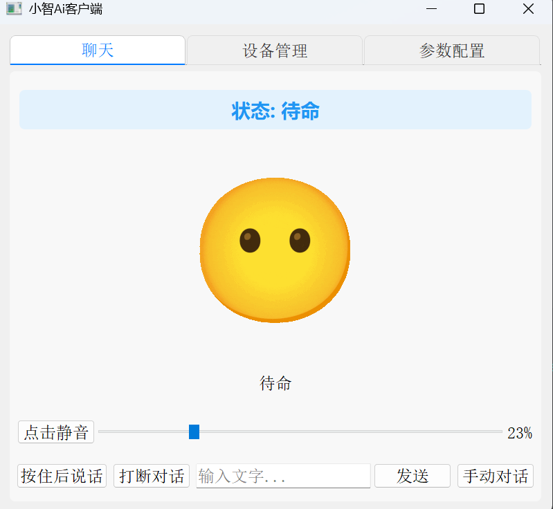

# 音声インタラクションモード説明



## プロジェクト概要

py-xiaozhiは、音声対話、IoTデバイス制御、視覚認識などの機能を含む複数の操作モードと機能をサポートするインテリジェント音声インタラクションアシスタントです。本ドキュメントでは主に音声インタラクションの基本的な使用方法を紹介します。

## 音声インタラクションモード

音声インタラクションは2つのモードをサポートしており、実際のニーズに応じて適切なインタラクション方式を選択できます：

### 1. 長押し対話モード

- **操作方法**：話すボタンを押し続け、手を離すと送信
- **適用シーン**：短い文での交流、対話の開始と終了時間を正確に制御
- **利点**：誤発動を避け、正確な制御
- **ショートカットキー**：Alt+Shift+V（押し続けて話す）

### 2. 自動対話モード

- **操作方法**：対話開始をクリック、システムが自動的に音声を検出して送信
- **適用シーン**：長い文での交流、手動制御不要
- **利点**：手を解放し、自然な交流
- **インターフェース表示**：「聞き取り中」の表示でシステムがあなたの音声を受信中であることを示す
- **ショートカットキー**：Alt+Shift+A（自動対話開始）

### モード切り替え

- GUIインターフェースの右下角に現在のモードを表示
- ボタンをクリックしてモードを切り替え
- Alt+Shift+Mショートカットキーでモード切り替え
- 設定ファイルでデフォルトモードを設定可能

## 対話制御

### 中断機能

システムが音声で返答している際、いつでも中断できます：
- **GUIモード**：Alt+Shift+Xまたはインターフェース上の中断ボタンを使用
- **CLIモード**：F3キーを使用

## システムトレイ

GUIモードでシステムトレイ機能をサポート：

- **状態表示**：トレイアイコンの色で現在のシステム状態を反映
  - 緑色：起動済み/待機状態
  - 黄色：聞き取り中状態
  - 青色：話し中状態
  - 赤色：エラー状態
  - 灰色：未接続状態
- **最小化**：ウィンドウを閉じると自動的にシステムトレイに最小化
- **終了**：トレイアイコンを右クリックして「プログラム終了」を選択してアプリケーションを完全に終了

### 状態遷移

音声インタラクションシステムには以下の状態があります：

```
                        +----------------+
                        |                |
                        v                |
+------+  ウェイクワード/ボタン  +------------+   |   +------------+
| IDLE | -----------> | CONNECTING | --+-> | LISTENING  |
+------+              +------------+       +------------+
   ^                                            |
   |                                            | 音声認識完了
   |          +------------+                    v
   +--------- |  SPEAKING  | <-----------------+
     再生完了 +------------+
```

- **IDLE**：アイドル状態、ウェイクワードまたはボタンのトリガーを待機
- **CONNECTING**：サーバーに接続中
- **LISTENING**：ユーザーの音声を聞き取り中
- **SPEAKING**：システムが音声で返答中

## ショートカットキー一覧

| 機能 | ショートカットキー | 説明 |
|------|--------|------|
| 押し続けて話す | Alt+Shift+V | 押し続けて録音、手を離すと送信（手動モードのみ） |
| 自動対話 | Alt+Shift+A | 自動対話を開始（自動で音声を検出して送信） |
| 対話中断 | Alt+Shift+X | 現在AIが行っている返答を中断 |
| モード切り替え | Alt+Shift+M | 手動対話/自動対話モード間で切り替え |

## 音声コマンド

システムは多種類の音声コマンドをサポートしており、以下は一般的なコマンド例です：

### 基本的なインタラクション
- "こんにちは"/"あなたは誰ですか" - 基本的な挨拶と身元確認
- "ありがとう"/"さようなら" - 礼儀表現

### IoT制御
- "リビングのライトをつけて/消して" - 照明制御
- "菊花台をIot音楽プレーヤーで再生して" - 音楽再生開始

### 視覚認識
- "カメラを開いて" - カメラを起動
- "画面を認識して" - 現在の画面を分析
- "何を認識しましたか" - AIが認識した内容を再生
- "カメラを閉じて" - カメラを終了

## 実行モード

### GUIモード実行（デフォルト）
```bash
python main.py
```

### CLIモード実行
```bash
python main.py --mode cli
```

### ビルドパッケージ

PyInstallerを使用して実行可能ファイルにパッケージ：

```bash
# 各プラットフォーム共通コマンド
python scripts/build.py
```

## プラットフォーム互換性説明

- **Windows**: すべての機能を完全サポート
- **macOS**: 
  - システムトレイは上部ステータスバーに表示、タスクバーではない
  - ショートカットキーの使用にはシステム権限の認可が必要な場合がある
- **Linux**: 
  - システムトレイサポートはデスクトップ環境（GNOME/KDE/Xfceなど）により異なる可能性
  - 一部のディストリビューションでは追加のシステムトレイサポートパッケージのインストールが必要な場合がある

## ベストプラクティス

1. **明確な発音**：静かな環境で明確に発音することを確認
2. **適切な間隔**：文章間の適切な間隔はシステム認識に有効
3. **ウェイクワードの使用**：ウェイクワード機能を有効にして、誤発動を回避
4. **フィードバックの確認**：インターフェースの状態表示に注意し、システムの現在状態を把握
5. **簡潔なコマンド**：簡潔で明確なコマンドを使用してより良い認識効果を得る

## ヘルプの取得

問題が発生した場合：

1. 優先的に docs/異常汇总.md ドキュメントを確認
2. GitHub Issues を通じて問題を提出
3. AI アシスタントを通じてヘルプを求める
4. 作者に連絡（ホームページにWeChat有り）（Todeskリンクを準備し、用件を説明してください。作者は平日の夜に対応します） 