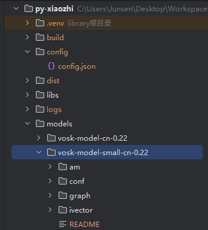

# 音声ウェイクアップ機能

## ウェイクワードモデル

音声ウェイクアップ機能を使用するには、ウェイクワードモデルをダウンロードして設定する必要があります：

- [ウェイクワードモデルダウンロード](https://alphacephei.com/vosk/models)
- ダウンロード完了後、解凍してルートディレクトリの/modelsに配置
- デフォルトでvosk-model-small-cn-0.22小モデルを読み込み
- 

## 音声ウェイクアップの有効化

1. 設定ファイル `/config/config.json` を開く
2. `WAKE_WORD_OPTIONS.USE_WAKE_WORD` を `true` に設定
3. `WAKE_WORD_OPTIONS.WAKE_WORDS` 配列でカスタムウェイクワードを設定可能
4. `WAKE_WORD_OPTIONS.MODEL_PATH` が正しく設定され、ダウンロードしたモデルを指していることを確認

設定例：
```json
{
  "WAKE_WORD_OPTIONS": {
    "USE_WAKE_WORD": true,
    "MODEL_PATH": "models/vosk-model-small-cn-0.22",
    "WAKE_WORDS": [
      "小智",
      "你好小智",
      "嘿小智"
    ]
  }
}
```

## 使用方法

1. プログラム起動後、システムがウェイクワードモデルを読み込み、自動的にウェイクワード監視状態に入る
2. 設定したウェイクワード（例：「小智」）を発話すると、システムが自動的にIDLE状態からLISTENING状態に切り替わる
3. この時点で続けて指示を発話することができる
4. 指示を発話しない場合、システムは一定時間後に自動的にウェイクワード監視状態に戻る

## 注意事項

1. ウェイクワードモデルの読み込みには一定の時間が必要です。お待ちください
2. ウェイクワード認識精度はモデル品質と環境ノイズに依存します
3. 異なるサイズのモデルを試すことができます。小モデルは高速ですが精度は低めです
4. 誤動作を避けるため、独特なウェイクワードの使用を検討してください
5. ウェイクワード機能の使用により、システムリソース使用量がわずかに増加します