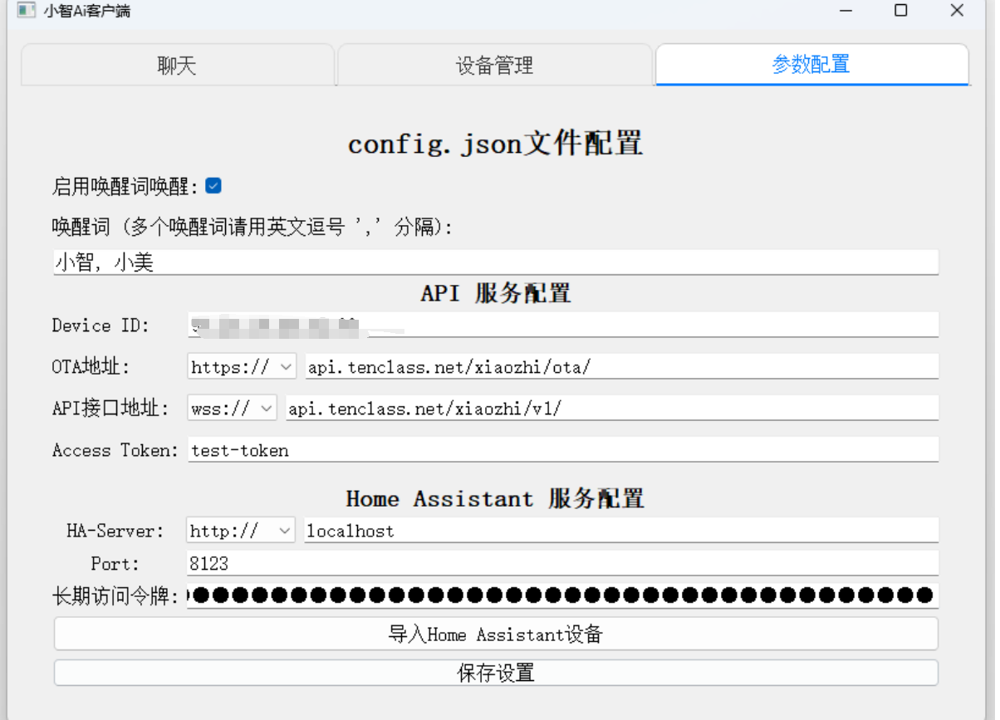
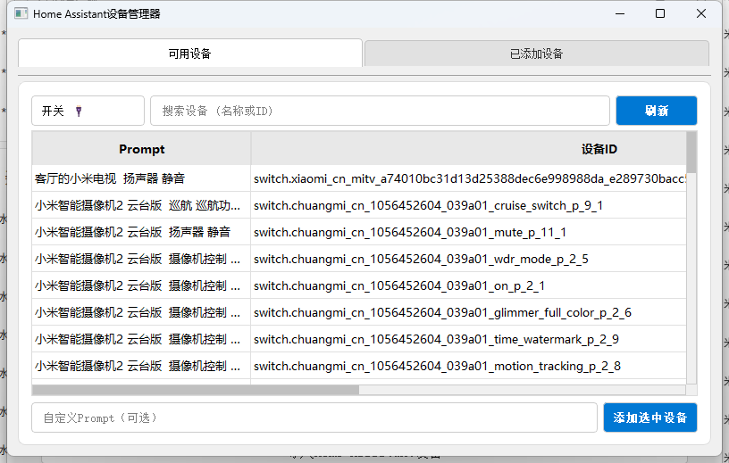
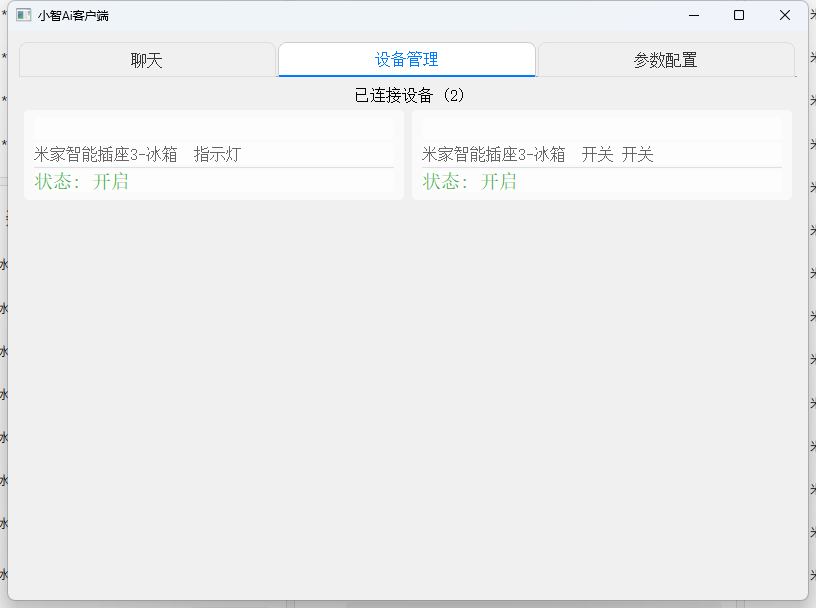

# IoT機能説明

## 概要

py-xiaozhi プロジェクトの IoT（モノのインターネット）モジュールは、音声コマンドを通じて多様な仮想および物理デバイスを制御する、柔軟で拡張可能なデバイス制御フレームワークを提供します。本ドキュメントでは、IoT モジュールのアーキテクチャ、使用方法、およびカスタムデバイスの拡張方法について詳しく説明します。
実行完了後すぐに状態を同期し結果を報告する必要がある場合は、カメラモジュールと温湿度モジュールを参照してください

## コアアーキテクチャ

IoT モジュールは階層設計を採用し、以下の主要コンポーネントで構成されています：

```
├── iot                          # IoT デバイス関連モジュール
│   ├── things                   # 具体的なデバイス実装ディレクトリ
│   │   ├── lamp.py              # ランプデバイス実装
│   │   ├── speaker.py           # 音量制御実装
│   │   ├── music_player.py      # 音楽プレーヤー実装
│   │   ├── countdown_timer.py   # カウントダウンタイマー実装
│   │   ├── ha_control.py        # Home Assistant デバイス制御
│   │   ├── CameraVL/            # カメラと視覚認識統合デバイス
│   │   ├── temperature_sensor.py# 温度センサー実装
│   │   └── query_bridge_rag.py  # RAG 検索ブリッジデバイス
│   ├── thing.py                 # IoT デバイス基底クラスとツールクラス定義
│   │   ├── Thing                # IoT デバイス抽象基底クラス
│   │   ├── Property             # デバイスプロパティクラス
│   │   ├── Parameter            # デバイスメソッドパラメータクラス
│   │   └── Method               # デバイスメソッドクラス
│   └── thing_manager.py         # IoT デバイスマネージャー
│       └── ThingManager         # シングルトンパターンで実装されたデバイスマネージャー
```

### コアクラス説明

1. **Thing（デバイス基底クラス）**：
   - すべての IoT デバイスの抽象基底クラス
   - プロパティとメソッドの登録メカニズムを提供
   - 状態と説明の JSON シリアライゼーションを提供

2. **Property（プロパティクラス）**：
   - デバイスの可変状態を定義（オン/オフ、明度など）
   - ブール値、数値、文字列の3つの基本タイプをサポート
   - getter コールバックを使用してデバイス状態をリアルタイムで取得

3. **Method（メソッドクラス）**：
   - デバイスが実行できる操作を定義（開く、閉じるなど）
   - パラメータ付きメソッド呼び出しをサポート
   - コールバックを通じて具体的な操作実装を処理

4. **Parameter（パラメータクラス）**：
   - メソッドのパラメータ仕様を定義
   - 名前、説明、タイプ、必須かどうかなどの情報を含む

5. **ThingManager（デバイスマネージャー）**：
   - すべての IoT デバイスインスタンスを集中管理
   - デバイス登録とコマンド配信を処理
   - デバイス説明と状態クエリインターフェースを提供

## コマンド処理フロー

以下は音声コマンドが処理され、IoT デバイス制御が実行される完全なフローです：

```
                              +-------------------+
                              |    ユーザー音声指示    |
                              +-------------------+
                                       |
                                       v
                              +-------------------+
                              |     音声認識      |
                              |     (STT)        |
                              +-------------------+
                                       |
                                       v
                              +-------------------+
                              |    意味理解       |
                              |    (LLM)         |
                              +-------------------+
                                       |
                                       v
                              +-------------------+
                              |   IoTコマンド生成   |
                              +-------------------+
                                       |
                                       v
+------------------------------+       |       +------------------------------+
|    WebSocketサーバー処理        |       |       |     Application._handle_iot_message()
|                             <--------+------->                             |
+------------------------------+               +------------------------------+
                                                           |
                                                           v
                                               +------------------------------+
                                               |   ThingManager.invoke()      |
                                               +------------------------------+
                                                           |
                      +-------------------------+----------+------------+
                      |                         |                       |
                      v                         v                       v
      +---------------+-------+    +------------+---------+   +---------+----------+
      |       Lamp            |    |      Speaker         |   |    MusicPlayer     |
      | (ランプデバイス制御)           |    | (システム音量制御)        |   | (音楽プレーヤー)        |
      +---------------+-------+    +------------+---------+   +---------+----------+
                      |                         |                       |
                      v                         v                       v
      +---------------+-------+    +------------+---------+   +---------+----------+
      |  デバイス関連操作実行      |    |   デバイス関連操作実行     |   |  デバイス関連操作実行   |
      +---------------+-------+    +------------+---------+   +---------+----------+
                      |                         |                       |
                      +-------------------------+-----------------------+
                                               |
                                               v
                                   +-----------------------------+
                                   |    デバイス状態更新              |
                                   |    Application._update_iot_states()
                                   +-----------------------------+
                                               |
                                               v
                                   +-----------------------------+
                                   |   サーバーへの状態更新送信       |
                                   |   send_iot_states()         |
                                   +-----------------------------+
                                               |
                                               v
                                   +-----------------------------+
                                   |     音声またはUIフィードバック       |
                                   +-----------------------------+
```

## 内蔵デバイス説明

### 1. ランプデバイス (Lamp)

基本的な IoT 制御機能をデモンストレーションするための仮想ランプデバイス。

**プロパティ**：
- `power`：ランプのオン/オフ状態（ブール値）

**メソッド**：
- `TurnOn`：ランプを点灯
- `TurnOff`：ランプを消灯

**音声コマンド例**：
- "ライトを点けて"
- "電気を消して"

### 2. システム音量制御 (Speaker)

システム音量を制御するデバイスで、アプリケーションの音量サイズを調整できます。

**プロパティ**：
- `volume`：現在の音量値（0-100）

**メソッド**：
- `SetVolume`：音量レベルを設定

**音声コマンド例**：
- "音量。50%に設定して"
- "音量を少し下げて"
- "音量を上げて"

### 3. 音楽プレーヤー (MusicPlayer)

楽曲検索、再生制御、歌詞表示をサポートする機能豊富なオンライン音楽プレーヤー。

**プロパティ**：
- `current_song`：現在再生中の楽曲
- `playing`：再生状態
- `total_duration`：楽曲の総再生時間
- `current_position`：現在の再生位置
- `progress`：再生進行状況

**メソッド**：
- `Play`：指定した楽曲を再生
- `Pause`：再生を一時停止
- `GetDuration`：再生情報を取得

**音声コマンド例**：
- "周杰倫の稲香をIoT音楽プレーヤーで再生して"
- "再生を一時停止"
- "次の曲を再生"

### 4. カウントダウンタイマー (CountdownTimer)

コマンドの遅延実行用のカウントダウンタイマーデバイスで、タイマータスクを設定できます。

**プロパティ**：
- クエリ可能なプロパティはありません

**メソッド**：
- `StartCountdown`：カウントダウンを開始し、終了後に指定したコマンドを実行
  - `command`：実行する IoT コマンド（JSON 形式文字列）
  - `delay`：遅延時間（秒）、デフォルトは5秒
- `CancelCountdown`：指定したカウントダウンをキャンセル
  - `timer_id`：キャンセルするタイマー ID

**音声コマンド例**：
- "5秒後にライトを点けて"
- "10秒後に音量。70%に設定"
- "タイマー3をキャンセル"

### 5. 温度センサー (TemperatureSensor)

MQTT プロトコルで接続された温湿度センサーデバイスで、環境の温湿度データをリアルタイムで取得できます。

**プロパティ**：
- `temperature`：現在の温度（摂氏）
- `humidity`：現在の湿度（%）
- `last_update_time`：最終更新時刻（タイムスタンプ）

**メソッド**：
- 呼び出し可能なメソッドはありません。デバイスは MQTT でデータを自動受信し状態を更新します

**特殊機能**：
- 新しい温湿度データを受信したとき、自動的に音声で結果を報告します

**音声コマンド例**：
- "現在の室内温度を教えて"
- "室内の湿度はどのくらい？"
- "温湿度センサーの状態"

### 6. Home Assistant デバイス制御 (HomeAssistantDevice)

HTTP API を通じて Home Assistant スマートホームプラットフォームに接続し、様々なスマートデバイスを制御します。

#### 6.1 Home Assistant ライトデバイス (HomeAssistantLight)

**プロパティ**：
- `state`：ライトの状態（on/off）
- `brightness`：ライトの明度（0-100）
- `last_update`：最終更新タイムスタンプ

**メソッド**：
- `TurnOn`：ライトを点灯
- `TurnOff`：ライトを消灯
- `SetBrightness`：ライトの明度を設定
  - `brightness`：明度値（0-100%）

**音声コマンド例**：
- "リビングのライトを点けて"
- "寝室のライトの明度。60%に設定"
- "すべてのライトを消して"

#### 6.2 Home Assistant スイッチ (HomeAssistantSwitch)

**プロパティ**：
- `state`：スイッチ状態（on/off）
- `last_update`：最終更新タイムスタンプ

**メソッド**：
- `TurnOn`：スイッチをオン
- `TurnOff`：スイッチをオフ

**音声コマンド例**：
- "扇風機を付けて"
- "エアコンを消して"

#### 6.3 HomeAssistant数值控制器 (HomeAssistantNumber)

**属性**：
- `state`：当前状态（on/off）
- `value`：当前数值
- `min_value`：最小值
- `max_value`：最大值
- `last_update`：最后更新时间戳

**方法**：
- `TurnOn`：打开设备
- `TurnOff`：关闭设备
- `SetValue`：设置数值
  - `value`：要设置的数值

**语音命令示例**：
- "把空调温度设为26度"
- "将风扇转速调到3档"

#### 6.4 HomeAssistant按钮 (HomeAssistantButton)

**属性**：
- `state`：当前状态（on/off，通常为虚拟状态）
- `last_update`：最后更新时间戳

**方法**：
- `TurnOn`：激活按钮（执行Press操作）
- `TurnOff`：形式方法，大多数情况下无实际效果
- `Press`：按下按钮，触发按钮关联的动作

**语音命令示例**：
- "按下门铃按钮"
- "触发紧急模式"
- "启动场景播放"

### 7. カメラと視覚認識 (CameraVL)

カメラ制御と視覚認識機能を統合し、映像をキャプチャしてインテリジェント分析を行うことができます。

**機能**：
- カメラのオン/オフ
- 映像のインテリジェント認識
- 視覚コンテンツ分析

**音声コマンド例**：
- "カメラをオンにして"
- "映像を認識して"
- "カメラをオフにして"

## カスタムデバイスの拡張

新しい IoT デバイスを追加するには、以下の手順に従ってください：

### 1. デバイスクラスの作成

`src/iot/things/` ディレクトリに新しい Python ファイルを作成し、デバイスクラスを定義します：

```python
from src.iot.thing import Thing, Parameter, ValueType

class MyCustomDevice(Thing):
    """
    自定义IoT设备实现示例
    
    此类演示了如何创建一个符合项目IoT架构的自定义设备，
    包括属性定义、方法注册以及实际功能实现
    """
    
    def __init__(self):
        # 调用父类初始化方法，设置设备名称和描述
        # 第一个参数是设备ID(全局唯一)，第二个参数是对设备的描述文本
        super().__init__("MyCustomDevice", "自定义设备描述")
        
        # 设备状态变量定义
        self.status = False  # 定义设备的开关状态，初始为关闭(False)
        self.parameter_value = 0  # 定义设备的参数值，初始为0
        self.last_update_time = 0  # 记录最后一次状态更新的时间戳
        
        # 设备初始化日志
        print("[IoT设备] 自定义设备初始化完成")
        
        # =========================
        # 注册设备属性（状态值）
        # =========================
        
        # 注册status属性，使其可被查询
        # 参数1: 属性名称 - 在JSON中显示的键名
        # 参数2: 属性描述 - 对此属性的解释说明
        # 参数3: getter回调函数 - 用于实时获取属性值的lambda函数
        self.add_property("status", "设备开关状态(True为开启，False为关闭)", 
                         lambda: self.status)
        
        # 注册parameter_value属性
        self.add_property("parameter_value", "设备参数值(0-100)", 
                         lambda: self.parameter_value)
        
        # 注册last_update_time属性
        self.add_property("last_update_time", "最后一次状态更新时间", 
                         lambda: self.last_update_time)
        
        # =========================
        # 注册设备方法（可执行的操作）
        # =========================
        
        # 注册TurnOn方法，用于打开设备
        # 参数1: 方法名称 - 用于API调用的标识符
        # 参数2: 方法描述 - 对此方法功能的说明
        # 参数3: 参数列表 - 空列表表示无参数
        # 参数4: 回调函数 - 执行实际功能的lambda函数，调用内部的_turn_on方法
        self.add_method(
            "TurnOn",  # 方法名称
            "打开设备",  # 方法描述
            [],  # 无参数
            lambda params: self._turn_on()  # 回调函数，调用内部的_turn_on方法
        )
        
        # 注册TurnOff方法，用于关闭设备
        self.add_method(
            "TurnOff", 
            "关闭设备",
            [], 
            lambda params: self._turn_off()
        )
        
        # 注册SetParameter方法，用于设置参数值
        # 此方法需要一个参数value
        self.add_method(
            "SetParameter", 
            "设置设备参数值(范围0-100)",
            # 定义方法所需参数:
            [
                # 创建参数对象: 
                # 参数1: 参数名称 - API中的参数键名
                # 参数2: 参数描述 - 对此参数的说明
                # 参数3: 参数类型 - 值类型(NUMBER表示数字类型)
                # 参数4: 是否必需 - True表示此参数必须提供
                Parameter("value", "参数值(0-100之间的数字)", ValueType.NUMBER, True)
            ],
            # 回调函数 - 从params字典中提取参数值并传递给_set_parameter方法
            lambda params: self._set_parameter(params["value"].get_value())
        )
        
        # 注册GetStatus方法，用于获取设备状态信息
        self.add_method(
            "GetStatus",
            "获取设备完整状态信息",
            [],  # 无参数
            lambda params: self._get_status()
        )
    
    # =========================
    # 内部方法实现（实际功能）
    # =========================
    
    def _turn_on(self):
        """
        打开设备的内部实现方法
        
        返回:
            dict: 包含操作状态和消息的字典
        """
        self.status = True  # 修改设备状态为开启
        self.last_update_time = int(time.time())  # 更新状态变更时间
        
        # 这里可以添加实际的硬件控制代码，如GPIO操作、串口通信等
        print(f"[IoT设备] 自定义设备已打开")
        
        # 返回操作结果，包含状态和消息
        return {
            "status": "success",  # 操作状态: success或error
            "message": "设备已打开"  # 操作结果消息
        }
    
    def _turn_off(self):
        """
        关闭设备的内部实现方法
        
        返回:
            dict: 包含操作状态和消息的字典
        """
        self.status = False  # 修改设备状态为关闭
        self.last_update_time = int(time.time())  # 更新状态变更时间
        
        # 这里可以添加实际的硬件控制代码
        print(f"[IoT设备] 自定义设备已关闭")
        
        # 返回操作结果
        return {
            "status": "success",
            "message": "设备已关闭"
        }
    
    def _set_parameter(self, value):
        """
        设置设备参数值的内部实现方法
        
        参数:
            value (float): 要设置的参数值
            
        返回:
            dict: 包含操作状态和消息的字典
            
        异常:
            ValueError: 如果参数值超出有效范围
        """
        # 参数值验证
        if not isinstance(value, (int, float)):
            return {"status": "error", "message": "参数必须是数字"}
        
        if not 0 <= value <= 100:
            return {"status": "error", "message": "参数值必须在0-100之间"}
        
        # 设置参数值
        self.parameter_value = value
        self.last_update_time = int(time.time())  # 更新状态变更时间
        
        # 这里可以添加实际的参数设置代码
        print(f"[IoT设备] 自定义设备参数已设置为: {value}")
        
        # 返回操作结果
        return {
            "status": "success",
            "message": f"参数已设置为 {value}",
            "value": value
        }
    
    def _get_status(self):
        """
        获取设备完整状态的内部实现方法
        
        返回:
            dict: 包含设备所有状态信息的字典
        """
        # 返回设备的完整状态信息
        return {
            "status": "success",
            "device_status": {
                "is_on": self.status,
                "parameter": self.parameter_value,
                "last_update": self.last_update_time
            }
        }

### 2. 注册设备

在程序启动时注册设备到ThingManager：

```python
# 在Application._initialize_iot_devices方法中
from src.iot.thing_manager import ThingManager
from src.iot.things.my_custom_device import MyCustomDevice
from src.utils.logging_config import get_logger

# 获取日志记录器实例
logger = get_logger(__name__)

def _initialize_iot_devices(self):
    """
    初始化并注册所有IoT设备
    此方法在应用程序启动时被调用
    """
    # 记录日志：开始初始化IoT设备
    logger.info("开始初始化IoT设备...")
    
    # 获取设备管理器单例实例
    # ThingManager使用单例模式，确保全局只有一个管理器实例
    thing_manager = ThingManager.get_instance()
    
    # 创建自定义设备实例
    my_device = MyCustomDevice()
    
    # 将设备实例添加到设备管理器
    # 一旦添加，设备将可以通过API和语音命令访问
    thing_manager.add_thing(my_device)
    
    # 记录成功添加设备的日志
    logger.info(f"已添加自定义设备: {my_device.name}")
    
    # 可以在这里继续添加其他设备...
    
    # 记录设备初始化完成的日志
    logger.info(f"IoT设备初始化完成，共注册了 {len(thing_manager.things)} 个设备")
```

### 3. 设备通信（可选）

如果设备需要与实体硬件通信，可以通过各种协议实现：

- MQTT：用于与标准物联网设备通信
- HTTP：用于REST API调用
- 串口/GPIO：用于直接硬件控制

## 使用示例

### 基本设备控制

1. 启动应用程序
2. 使用语音指令"打开灯"
3. 系统识别指令并执行lamp.py中的TurnOn方法
4. 灯设备状态更新，反馈给用户"灯已打开"

### 音乐播放控制

1. 使用指令"播放音乐周杰伦的稻香，通过iot音乐播放器播放"
2. 系统解析指令并调用MusicPlayer的Play方法
3. 播放器搜索歌曲，开始播放，并显示歌词
4. 可以继续使用"暂停播放"等命令控制播放

### 倒计时控制示例

1. 使用指令"设置5秒后打开灯"
2. 系统解析指令并调用CountdownTimer的StartCountdown方法
3. 5秒后自动执行打开灯的命令
4. 返回操作结果"倒计时已设置"

### Home Assistant设备控制示例

1. 使用指令"把客厅灯调暗一点"
2. 系统解析指令并调用HomeAssistantLight的SetBrightness方法
3. 通过HTTP API向Home Assistant发送亮度调整命令
4. 返回操作结果"客厅灯亮度已调整"

## 注意事项

1. 设备属性更新后，会自动通过WebSocket推送状态到服务端和UI界面
2. 设备方法的实现应该考虑异步操作，避免阻塞主线程
3. 参数类型和格式应严格遵循ValueType中定义的类型
4. 新增设备时应确保设备ID全局唯一
5. 所有设备方法应该实现适当的错误处理和反馈机制

## 高级主题：Home Assistant集成

### 通过HTTP API控制Home Assistant

Home Assistant是一个流行的开源家庭自动化平台，本项目通过HTTP API与Home Assistant集成，支持控制各种智能设备。以下是Home Assistant集成的关键点：

1. **配置文件设置**

在`config/config.json`中添加Home Assistant配置：

```json
{
  "HOME_ASSISTANT": {
    "URL": "http://your-homeassistant-url:8123",
    "TOKEN": "your-long-lived-access-token",
    "DEVICES": [
      {
        "entity_id": "light.cuco_cn_573924446_v3_s_13_indicator_light",
        "friendly_name": "米家智能插座3-冰箱  指示灯"
      },
      {
        "entity_id": "switch.cuco_cn_573924446_v3_on_p_2_1",
        "friendly_name": "米家智能插座3-冰箱  开关 开关"
      }
    ]
  }
}
```
### 配置ha地址和密钥

### 设备选择
- 左上角开关处点击可以切换设备类型
- 选中设备后天机右下角添加选中设备
- 导入后需要重启小智等待程序加载完成就可以通过语音控制了

### 导入后

2. **支持的设备类型**

- `light`: 灯设备，支持开关和亮度控制
- `switch`: 开关设备，支持开关控制
- `number`: 数值控制器，支持设置数值
- `button`: 按钮设备，支持按下操作

3. **语音命令示例**

- "打开客厅灯"
- "把卧室灯调暗一点"
- "将空调温度设为26度"
- "关闭所有灯"

### 通信协议限制

当前IoT协议(1.0版本)存在以下限制：

1. **单向控制流**：大模型只能下发指令，无法立即获取指令执行结果
2. **状态更新延迟**：设备状态变更需要等到下一轮对话时，通过读取property属性值才能获知
3. **异步反馈**：如果需要操作结果反馈，必须通过设备属性的方式间接实现

### 最佳实践

1. **使用有意义的属性名称**：属性名称应清晰表达其含义，便于大模型理解和使用

2. **不产生歧义的方法描述**：为每个方法提供明确的自然语言描述，帮助大模型更准确地理解和调用